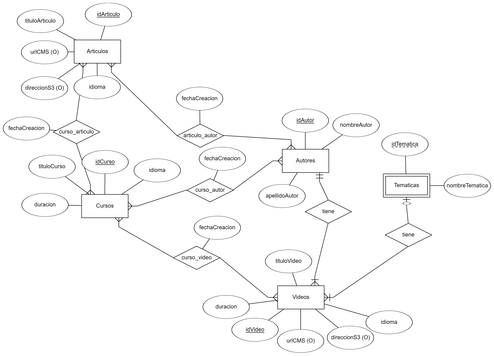

# Modelado Relacional

## Introducción

Laboratorio del módulo 1 del Bootcamp Backend - Modelado.

Vamos a simular que tenemos que modelar la base de datos de un portal en el que se exponen videos técnicos, categorizado por temática, autor, ...

## Enunciado

Una startup tecnológica va a desarrollar un portal de ELearning y nos ha pedido que realizamos el modelo de datos de dicho sistema.

A tener en cuenta:

<ul>
  <li>Va a ser un portal orientado al mundo de la programación.</li>
  <li>El portal va a estar compuesto por cursos, cada curso está compuesto a su vez por un número de videos y artículos que lo acompañen.</li>
  <li>Los videos y el contenido de cada artículo se almacenan en un storage S3 y en un headless CMS, en la base de datos sólo almacenaremos los Id's a esos recursos.   </li>
  <li>Los videos se puede clasificar por temáticas (Devops / Front End / Back End / ...)</li>
  <li>Los videos tienen autores (ponemos la restricción, un video tiene un autor), un curso puede tener varios autores.
</li>
</ul>

## Parte obligatoria

Generar un modelado que refleje los siguiente requerimientos:

<ul>
  <li>Queremos mostrar los últimos cursos publicados.</li>
  <li>Queremos mostrar cursos por área (devops / front End ...).</li>
  <li>Queremos mostrar un curso con sus videos.</li>
  <li>En un video queremos mostrar su autor.</li>
</ul>

## Entregable

Se tienen que generar los siguientes ficheros:

<ul>
  <li>Diagrama del modelo de datos.</li>
  <li>Markdown con explicación de porque se ha realizado dicho modelado, patrones aplicados y razón.
</li>
</ul>

## Solución

De acuerdo al enunciado se han establecuido las siguientes entidades:

<ul>
  <li>Cursos</li>
  <li>Autores</li>
  <li>Artículos</li>
  <li>Videos</li>
  <li>Temáticas</li>
</ul>

La entidad <b>Cursos</b> se relaciona con <b> Autores, Artículos y Videos </b> con una relación, valga la redundancia, muchos a muchos. Al igual que las entidades <b>Autores y Artículos</b>. Creando nuevas tablas con claves primarias compuestas. Por otra parte, la entidad <b>Videos</b> se relaciona con <b>Temática</b>, entidad débil, con una relación uno a muchos, al igual que que <b>Autores y Videos</b>.

<b>Figura 1.1:</b> Diagrama E/R.

Se puede observar el Esquema Relacional en el archivo. Con esta estructura se pueden dar respuesta a las preguntas solicitadas. Por ejemplo, la primera pregunta se puede obtener con un atributo calculado de la tabla <b>Autores_Cursos</b>, a partir de la fecha de creación. Los Videos de un curso se pueden obtener de la tabla <b>Cursos_Videos</b>. Para mostrar el autor de un Video se usan las tablas<b> Videos y Autores</b>. Finalmente, la temática de un curso se puede obtener de las tablas; <b>Cursos, Videos y Temática</b>.

